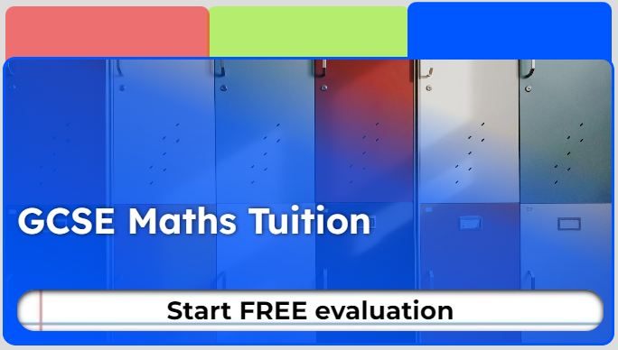
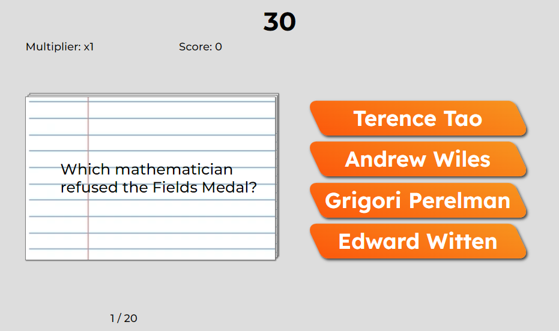

<h1 align="center">Math Masters Academy</h1>

[View the deployed website](https://nyxhexen.github.io/CI_MS2_MM/index.html)

---

## Introduction
An online based mathematics academy. Whether 5 or 65 we have got something for everyone! Discover interactive online maths tuition at it's best!

---

## Table of Contents
### 1. [Project Goals](#1-project-goals-1) 

### 2. [User Experience](#2-user-experience-1)
1. [Target Audience](#target-audience)
2. [User Stories](#user-stories)
3. [Scope](#scope)
4. [Design](#design)
5. [Wireframes](#wireframes)

### 3. [Features](#3-features-1)

### 4. [Technology](#4-technology-1)

### 5. [Testing](#5-testing-1)
1. [HTML Validation](#html-validation)
2. [CSS Validation](#css-validation)
3. [Accessibility](#accessibility)
4. [Performance](#performance)
5. [Browser Compatibility](#browser-compatibility)
6. [Device Testing](#devices-tested-on)
7. [Testing User Stories](#testing-user-stories)

### 6. [Bug/Fix Log](#6-bugfix-log-1)

### 7. [How-to DIY: GitHub Deploy, Fork, Clone](#7-how-to-diy-github-deploy-fork--clone)

### 8. [Credits](#8-credits-1)
1. [Code](#code)
2. [Media](#media)
3. [Acknowledgements](#acknowledgements)

---

## 1. Project Goals
[`Back To Top`](#table-of-contents)

### User Goals:
- Find an online school;
- Find the academy's location;
- Book a mathematics class;
- Play a mathematics-themed quiz;

### Site Owner Goals:
- Increase brand awareness;
- Create traffic by designing a fun quiz;
- Provide clients with an easy way to book classes;
- Provide customers contact details and location;
- Market online courses;

---

## 2. User Experience
[`Back To Top`](#table-of-contents)

### Target Audience:
- People who like quizzes;
- People interested in mathematics;
- People looking to study mathematics;
- People interested in different teaching methodology;

### User Requirements:
- Fully responsive website;
- Visually appealing and relevant content;
- Fully functioning links and buttons;
- Accessibility;
- Contact information and location;
- Information about the product marketed;

### User Stories

#### New Customers
1. As a new customer, I want to know what Math Masters Academy is.
2. As a new customer, I want to find out how to contact the academy via phone.
3. As a new customer, I want to find out how to contact the academy via email.
4. As a new customer, I want to learn about the products offered.
5. As a new customer, I want to find out what to expect if I purchase a class.
6. As a new customer, I want to find out where the classes are held.
7. As a new customer, I want to find out where the main offices are.
8. As a new customer, I want to read the terms and conditions.
9. As a new customer, I want to read the privacy policy.

#### Returning customers
10. As a returning customer, I want to visit the company's social media websites.
11. As a returning user, I want to view the classes available.
12. As a returning user, I want to book a class.
13. As a returning user, I want to find out how to play the quiz.
14. As a returning user, I want to play the quiz.
15. As a returning user, I want to see my quiz score.
16. As a returning user, I want to sign up to the newsletter.
17. As a returning user, I want to find out if the classes are suitable for my age.

#### Site Owner
18. As a site owner, I want users to play the quiz.
19. As a site owner, I want users to learn about our products.
20. As a site owner, I want users to market our products.
21. As a site owner, I want users to visit our social media pages.
22. As a site owner, I want users to have access to our Terms and Conditions.
23. As a site owner, I want users to have access to our Privacy Policy.
24. As a site owner, I want users to subscribe to our newsletter.
25. As a site owner, I want users to book classes easily.
26. As a site owner, I want users to be able to contact us.

### Scope

#### The scope of the project at release is defined as below:
- A mobile-first fully responsive website.
- Navigation bar to allow users to explore the website.
- Footer with logo, social links, and legal information (Privacy Policy, T&C).
- A hamburger menu for mobile and tablet users.
- Marketing content for the company.
- Interactive carousel.
- Interactive section with onboarding information.
- A booking system with confirmation mailing.
- Newsletter form.
- Contact Us section.
- Mathematics-themed quiz.

### Design
The design revolves around a school theme. The idea was to create a simple, but highly interactive website.

#### Color Scheme

#### Typography
- The <b>fallback</b> font chosen across the website is 'sans-serif' for it's accessibility.
- All <b>headings</b> and buttons use 'Lexend'.
- All <b>other</b> elements use 'Montserrat'.

#### Images

The images across the website are sourced through Unsplash and Google Search. Sources and images are listed/shown below.

 Carousel Images 

Source: [PNGTree.com](https://pngtree.com/freebackground/color-pen-doodle-education-math-formula-background_1457815.html)

Source: [Unsplash - RUT MIIT](https://unsplash.com/photos/hpRGrfOIybc)

Source: [Unsplash - Moren Hsu](https://unsplash.com/photos/VLaKsTkmVhk)

 Methodology Section 

Source: [Unsplash - Nguyen Dang Hoang Nhu](https://unsplash.com/photos/FrzGKG2Yvpw)

Source: [Matt Ragland](https://unsplash.com/photos/02z1I7gv4ao)

Source: [Unsplashed - Towfiqu barbhuiya](https://unsplash.com/photos/5u6bz2tYhX8)

 Marketing Section 

Source: [Unsplash - Kenny Eliason](https://unsplash.com/photos/zFSo6bnZJTw)

 Quiz Page 

Source: [Vertex42 - Printable Lined Paper - College Ruled](https://www.vertex42.com/WordTemplates/printable-lined-paper.html)

 Booking Section 

Source: [The Empire of Films - Pythagoras](https://theempireoffilms.files.wordpress.com/2012/08/pythagoras.jpg?w=764)

Source: [The Famous People - Archimedes](https://www.thefamouspeople.com/profiles/archimedes-422.php)

Source: [Wikipedia - Alan Turing](https://en.wikipedia.org/wiki/Alan_Turing#/media/File:Alan_Turing_Aged_16.jpg)

Source: [Wikipedia - Isaac Newton](https://en.wikipedia.org/wiki/Isaac_Newton#/media/File:Portrait_of_Sir_Isaac_Newton,_1689.jpg)

Source: [Freepik - Storyset](https://img.freepik.com/free-vector/no-data-concept-illustration_114360-2506.jpg?w=1380&t=st=1663687057~exp=1663687657~hmac=b2b66b0fffcbff4f85727623407a2cc25f6b26736c52e3b0205de271da39ac11)

---

### Wireframes

|Mobile Wireframes 
|-------------------
|

1. Home Page

|

2. Quiz Page

|

3. Booking Page

|Tablet Wireframes 
|-------------------
|

1. Home Page

|

2. Quiz Page

|

3. Booking Page

|Desktop Wireframes 
|-------------------
|

1. Home Page

|

2. Quiz Page

|

3. Booking Page

---

## 3. Features
[`Back To Top`](#table-of-contents)
The website consists of 3 responsive pages with 1 to 3 features per page.

Each page has 2 general layout shifts between handheld devices and desktop devices.

### Features at release
Header and footer sections are shared across all pages.

I've kept both relatively clean as the content of the pages themselves contain a lot of information, so it helps balance things out.

 1. Header

The header consists of 2 sections. 

1. Logo - I was able to create a very simple and effective logo by combining the Maths theme (hence the squared) and the M from both Math and Masters.

 Supporting Images

2. Nav Menu - A very clean design with some animations to make it smoother. In handheld devices the nav bar turns into a hamburger menu. The styling of both version is relatively similar.

 Supporting Images

Footer contains the full logo of the company, social media links and buttons which control a modal. Just like the header has been kept minimalist, with all of the content being centered.

 2. Footer

1. Social Media Links  - Used Fontawesome's icons within an anchor element.

 Supporting Image

_User Story Covered - 10, 21_

2. Modal Buttons - An event listener attached to divs with a `role="button"`. Upon click brings a modal on top of the page content. There is only one modal being used by both buttons, so depending on which one is clicked the content is being changed in the background. The modal by default contain an error message, so in the event that only the event listener loads - we still have content to advise the user something has gone wrong.

 Supporting Image

If Terms & Conditions is clicked: 

 Supporting Image

If Privacy Policy is clicked: 

 Supporting Image

_User Story Covered - 8, 9, 22, 23_

#### index.html - Home Page 
Home page consists of 3 features. 

The home page is relatively busy, using various content to grab the user's attention. 

1. Carousel - Made up of tabs and slides with buttons. When a slide is active the appropriate slide is shown while the tab is raised and its color made opaque, while inactive slides are hidden and inactive tabs have their opacity reduced. The logic controlling the change of slide uses a `setInterval()` function set to trigger every 5 seconds (5000ms) and 'active' class styles. Each button takes the page to a different page on the website.

 Supporting Image

_User Stories Covered - 20_

2. Methodology Section - Consists for 3 interactive sub-sections. When clicked each section blurs and darkens its background and shows text. When clicked again reverts to its original state.

 Supporting Image

_User Stories Covered - 5, 19_ 

3. Contact Us Section - Contains classes information section, a Google Maps `iframe`, and the academy's contact information and address.

    Each of the app icons navigates to the app's home page in a new tab.

    Google Maps has a pin and displays the address.

    Activating the phone number redirects to the mobile phone's dial pad, while the e-mail address gets passed to the operating system which opens the default mailing agent.

 Supporting Image

_User Stories Covered - 6, 26, 7_

#### Quiz Page - quiz.html 

The quiz page contains only 1 feature, the quiz itself.

 Supporting Image

The first thing the user is greeted is by the instructions/details, an input field for the user's name and a disabled (for now) "Let's go!" button. In order to enable the button the user will need to input a minium of any 3 characters, however the name cannot contain spaces. After typing the name and pressing the start button, the modal disappears and the game starts. 

 Supporting Image

As the game starts, a timer is set to 30 seconds, the question is displayed and the answers are loaded. Each question has only one correct answer. 

The scoring of the game is based on picking correct answer, how many correct answers the user has answered, if the user is on a spree, and how long it takes for the user to answer. For every two correct answers the user hits a spree. Every time the user hits a spree the timer is reduced by 10 seconds, until it hits 10 seconds total, then further reduced down to 5; the multiplier is also increased by 1, up to a maximum of 10. The default points for answered questions is 10, which is multiplier by the multiplier value at the time of answering the question, for a maximum of `100` points The score is further increased by how short the timer is at the time of calculation and how much time left when the answer was clicked. If the timer maximum duration is 30, there is no additional multiplier, it returns 30 points. If the maximum duration is 20, the time left is multiplier by 3. If 10 - multiplied by 5. If 5 - multiplied by 100; for a total maximum of `500` points from the timer scoring. The maximum total score at the end of the game is `8760` points.

At the end of the game the modal re-appears with the results from the game.

 Supporting Image

_User Stories Covered - 13, 14, 15, 18_

#### Booking Page - booking.html 

---

## 4. Technology
[`Back To Top`](#table-of-contents)

|Technology | Specification |
|---|---|
|Operating System | Windows 10 x64|
|IDE | Visual Studio Code |
|Version Control| Git |
|Deployment | GitHub Pages |
|Languages | HTML5, CSS3 & JavaScript |
|Font - Headings & Buttons | https://fonts.google.com/specimen/Lexend |
|Font - Other | https://fonts.google.com/specimen/Montserrat?query=montser |
|Font - Fallback | sans-serif |
|Responsive Mockup | https://ui.dev/amiresponsive |
|Image Converter | https://www.freeconvert.com/png-to-webp |

---

## 5. Testing
[`Back To Top`](#table-of-contents)

### HTML Validation 

[W3C Markup Validation Service](https://validator.w3.org/) was used to validate the HTML of the website. 

### CSS Validation

[W3C CSS Validation Service](https://jigsaw.w3.org/css-validator/) was used to validate the CSS of the website.

### JavaScript Validation

[JS Hint](https://jshint.com/) was used to validate the JavaScript of the website.

### Accessibility

[WAVE WebAIM Web Accessibility (Chrome Plugin)](https://chrome.google.com/webstore/detail/wave-evaluation-tool/jbbplnpkjmmeebjpijfedlgcdilocofh) was used to check that the code meets accessibility standards.

### Performance

[Google Lighthouse](https://developer.chrome.com/docs/lighthouse/overview/) was used to measure the website's speed and performance. 

### Browser compatibility:

- Microsoft Edge: 
- Google Chrome: 
- Firefox: 
- Opera/Opera GX: 
- Safari: 

### Devices tested on:

- Tower desktop with 27" monitor;
- OnePlus 9 Pro.

### Test Performed

### Testing User Stories

## 6. Bug/Fix Log

| ID | Bug | Fix
|--- |--- |---
| 1 | |

---

## 7. How-to DIY: GitHub Deploy, Fork & Clone
[`Back To Top`](#table-of-contents)

This website was deployed using GitHub Pages.

### GitHub Pages Deploy
1. Navigate to the repository containing the project you would like published.
2. Click on Settings.
3. On the vertical bar below, click Pages.
4. Select the branch and root folder of the project that you want to deploy.
5. Press Save and hope for the best.
6. If you carefully followed the instructions, you should now have a green message at the top containing a URL to your published site.

### Fork a Repository
1. Navigate to the repository containing the project you would like forked.
2. At the top-right corner of the page, click Fork.
3. Ta-da!

### Clone a Repository 
1. Navigate to the repository containing the project you would like cloned.
2. Above the list of files, click on Code.
3. Copy the URL.
4. Create a new working directory, one you will be cloning to.
5. Open your IDE of choice and open a terminal.
6. Type `git clone` followed by the URL you copied earlier.
7. Press Enter and in a moment or so it should complete.

--- 

## 8. Credits
[`Back To Top`](#table-of-contents)

### Code

### Media

### Acknowledgements
