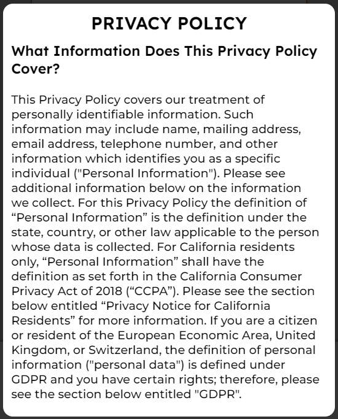
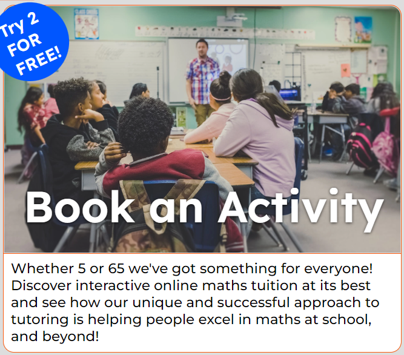
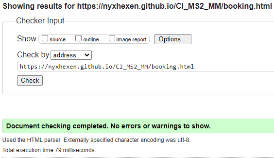
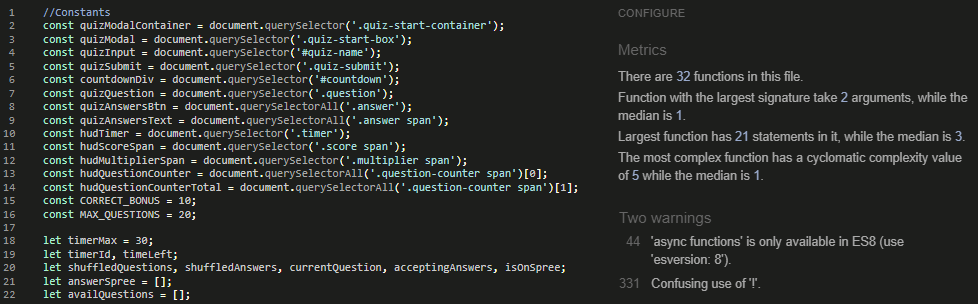
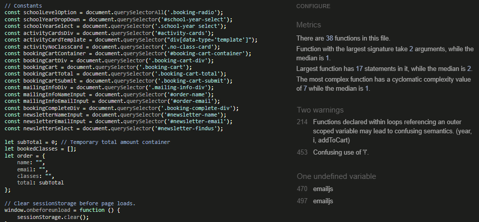
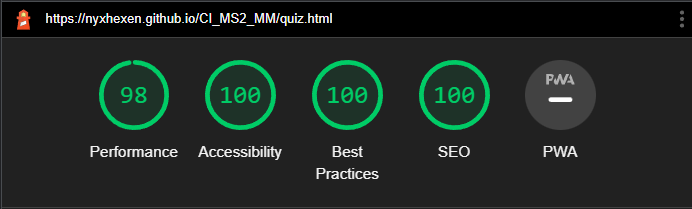
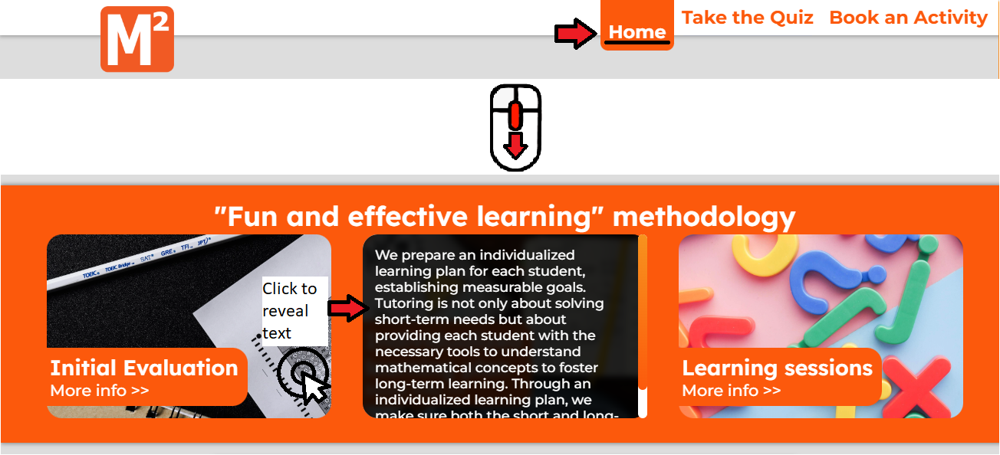

<h1 align="center">Math Masters Academy</h1>

[View the deployed website](https://nyxhexen.github.io/CI_MS2_MM/index.html)

---

## Introduction
An online based mathematics academy. Whether 5 or 65 we have got something for everyone! Discover interactive online maths tuition at it's best!

---

## Table of Contents
### 1. [Project Goals](#1-project-goals-1) 

### 2. [User Experience](#2-user-experience-1)
1. [Target Audience](#target-audience)
2. [User Stories](#user-stories)
3. [Scope](#scope)
4. [Design](#design)
5. [Wireframes](#wireframes)

### 3. [Features](#3-features-1)

### 4. [Technology](#4-technology-1)
 
### 5. [Testing](#5-testing-1)
1. [HTML Validation](#html-validation)
2. [CSS Validation](#css-validation)
3. [Accessibility](#accessibility)
4. [Performance](#performance)
5. [Browser Compatibility](#browser-compatibility)
6. [Device Testing](#devices-tested-on)
7. [Testing User Stories](#testing-user-stories)

### 6. [Bug/Fix Log](#6-bugfix-log-1)

### 7. [How-to DIY: GitHub Deploy, Fork, Clone](#7-how-to-diy-github-deploy-fork--clone)

### 8. [Credits](#8-credits-1)
1. [Code](#code)
2. [Media](#media)
3. [Acknowledgements](#acknowledgements)

---

## 1. Project Goals
[`Back To Top`](#table-of-contents)

### User Goals:
- Find an online school;
- Find the academy's location;
- Book a mathematics class;
- Play a mathematics-themed quiz;

### Site Owner Goals:
- Increase brand awareness;
- Create traffic by designing a fun quiz;
- Provide clients with an easy way to book classes;
- Provide users with contact details and location;
- Market online courses;

---

## 2. User Experience
[`Back To Top`](#table-of-contents)

### Target Audience:
- People who like quizzes;
- People interested in mathematics;
- People looking to study mathematics;
- People interested in different teaching methodology;

### User Requirements:
- Fully responsive website;
- Visually appealing and relevant content;
- Fully functioning links and buttons;
- Accessibility;
- Contact information and location;
- Information about the product marketed;

### User Stories

#### New Users
1. As a new user, I want to know what Math Masters Academy is.
2. As a new user, I want to find out how to contact the academy via phone.
3. As a new user, I want to find out how to contact the academy via email.
4. As a new user, I want to learn about the products offered.
5. As a new user, I want to find out what to expect if I purchase a class.
6. As a new user, I want to find out where the classes are held.
7. As a new user, I want to find out where the main offices are.
8. As a new user, I want to read the terms and conditions.
9. As a new user, I want to read the privacy policy.

#### Returning users
10. As a returning user, I want to visit the company's social media websites.
11. As a returning user, I want to view the classes available.
12. As a returning user, I want to book a class.
13. As a returning user, I want to find out how to play the quiz.
14. As a returning user, I want to play the quiz.
15. As a returning user, I want to see my quiz score.
16. As a returning user, I want to sign up to the newsletter.

#### Site Owner
17. As a site owner, I want users to play the quiz.
18. As a site owner, I want users to learn about our products.
19. As a site owner, I want to market our products.
20. As a site owner, I want users to visit our social media pages.
21. As a site owner, I want users to have access to our Terms and Conditions.
22. As a site owner, I want users to have access to our Privacy Policy.
23. As a site owner, I want users to subscribe to our newsletter.
24. As a site owner, I want users to book classes easily.
25. As a site owner, I want users to be able to contact us.

### Scope

#### The scope of the project at release is defined as below:
- A mobile-first fully responsive website.
- Navigation bar to allow users to explore the website.
- Footer with logo, social links, and legal information (Privacy Policy, T&C).
- A hamburger menu for mobile and tablet users.
- Marketing content for the company.
- Interactive carousel.
- Interactive section with onboarding information.
- A booking system with confirmation mailing.
- Newsletter form.
- Contact Us section.
- Mathematics-themed quiz.

### Design
The design revolves around a school theme. The idea was to create a simple, but highly interactive website.

#### Color Scheme

#### Typography
- The <b>fallback</b> font chosen across the website is 'sans-serif' for it's accessibility.
- All <b>headings</b> and buttons use 'Lexend'.
- All <b>other</b> elements use 'Montserrat'.

#### Images

The images across the website are sourced through Unsplash and Google Search. Sources and images are listed/shown below.

 Carousel Images 

Source: [PNGTree.com](https://pngtree.com/freebackground/color-pen-doodle-education-math-formula-background_1457815.html)

Source: [Unsplash - RUT MIIT](https://unsplash.com/photos/hpRGrfOIybc)

Source: [Unsplash - Moren Hsu](https://unsplash.com/photos/VLaKsTkmVhk)

 Methodology Section 

Source: [Unsplash - Nguyen Dang Hoang Nhu](https://unsplash.com/photos/FrzGKG2Yvpw)

Source: [Unsplashed - Matt Ragland](https://unsplash.com/photos/02z1I7gv4ao)

Source: [Unsplashed - Towfiqu barbhuiya](https://unsplash.com/photos/5u6bz2tYhX8)

 Marketing Section 

Source: [Unsplash - Kenny Eliason](https://unsplash.com/photos/zFSo6bnZJTw)

 Quiz Page 

Source: [Vertex42 - Printable Lined Paper - College Ruled](https://www.vertex42.com/WordTemplates/printable-lined-paper.html)

 Booking Section 

Source: [The Empire of Films - Pythagoras](https://theempireoffilms.files.wordpress.com/2012/08/pythagoras.jpg?w=764)

Source: [The Famous People - Archimedes](https://www.thefamouspeople.com/profiles/archimedes-422.php)

Source: [Wikipedia - Alan Turing](https://en.wikipedia.org/wiki/Alan_Turing#/media/File:Alan_Turing_Aged_16.jpg)

Source: [Wikipedia - Isaac Newton](https://en.wikipedia.org/wiki/Isaac_Newton#/media/File:Portrait_of_Sir_Isaac_Newton,_1689.jpg)

Source: [Freepik - Storyset](https://img.freepik.com/free-vector/no-data-concept-illustration_114360-2506.jpg?w=1380&t=st=1663687057~exp=1663687657~hmac=b2b66b0fffcbff4f85727623407a2cc25f6b26736c52e3b0205de271da39ac11)

---

### Wireframes

|Mobile Wireframes 
|-------------------
|

1. Home Page

|

2. Quiz Page

|

3. Booking Page

|Tablet Wireframes 
|-------------------
|

1. Home Page

|

2. Quiz Page

|

3. Booking Page

|Desktop Wireframes 
|-------------------
|

1. Home Page

|

2. Quiz Page

|

3. Booking Page

---

## 3. Features
[`Back To Top`](#table-of-contents)
The website consists of 3 responsive pages with 1 to 3 features per page.

Each page has 2 general layout shifts between handheld devices and desktop devices.

### Features at release
Header and footer sections are shared across all pages.

I've kept both relatively clean as the content of the pages themselves contain a lot of information, so it helps balance things out.

 1. Header

The header consists of 2 sections. 

1. Logo - I was able to create a very simple and effective logo by combining the Maths theme (hence the squared) and the M from both Math and Masters.

 Supporting Images

2. Nav Menu - A very clean design with some animations to make it smoother. In handheld devices the nav bar turns into a hamburger menu. The styling of both version is relatively similar.

 Supporting Images

Footer contains the full logo of the company, social media links and buttons which control a modal. Just like the header has been kept minimalist, with all of the content being centered.

 2. Footer

1. Full Logo - Full version of the academy's logo.

_User Story Covered - 1_

2. Social Media Links  - Used Fontawesome's icons within an anchor element.

 Supporting Image

_User Story Covered - 10, 21_

3. Modal Buttons - An event listener attached to divs with a `role="button"`. Upon click brings a modal on top of the page content. There is only one modal being used by both buttons, so depending on which one is clicked the content is being changed in the background. The modal by default contain an error message, so in the event that only the event listener loads - we still have content to advise the user something has gone wrong.

 Supporting Image

If Terms & Conditions is clicked: 

 Supporting Image

If Privacy Policy is clicked: 

 Supporting Image

_User Story Covered - 8, 9, 22, 23_

### index.html - Home Page 
Home page consists of 3 features. 

The home page is relatively busy, using various content to grab the user's attention. 

1. Carousel - Made up of tabs and slides with buttons. When a slide is active the appropriate slide is shown while the tab is raised and its color made opaque, while inactive slides are hidden and inactive tabs have their opacity reduced. The logic controlling the change of slide uses a `setInterval()` function set to trigger every 5 seconds (5000ms) and 'active' class styles. Each button takes the page to a different page on the website.

 Supporting Image

_User Stories Covered - 20_

2. Methodology Section - Consists for 3 interactive sub-sections. When clicked each section blurs and darkens its background and shows text. When clicked again reverts to its original state.

 Supporting Image

_User Stories Covered - 5, 19_ 

3. About Us Section - Contains classes information section, a Google Maps `iframe`, and the academy's contact information and address.

    Each of the app icons navigates to the app's home page in a new tab.

    Google Maps has a pin and displays the address.

    Activating the phone number redirects to the mobile phone's dial pad, while the e-mail address gets passed to the operating system which opens the default mailing agent.

 Supporting Image

_User Stories Covered - 2, 3, 6, 26, 7_

### Quiz Page - quiz.html 

The quiz page contains only 1 feature, the quiz itself.

 Supporting Image

The first thing the user is greeted is by the instructions/details, an input field for the user's name and a disabled (for now) "Let's go!" button. In order to enable the button the user will need to input a minium of any 3 characters, however the name cannot contain spaces. After typing the name and pressing the start button, the modal disappears and the game starts. 

 Supporting Image

As the game starts, a timer is set to 30 seconds, the question is displayed and the answers are loaded. Each question has only one correct answer. 

The scoring of the game is based on picking correct answer, how many correct answers the user has answered, if the user is on a spree, and how long it takes for the user to answer. For every two correct answers the user hits a spree. Every time the user hits a spree the timer is reduced by 10 seconds, until it hits 10 seconds total, then further reduced down to 5; the multiplier is also increased by 1, up to a maximum of 10. The default points for answered questions is 10, which is multiplied by the multiplier value at the time of answering the question, for a maximum of `100` points The score is further increased by how short the timer is at the time of calculation and how much time left when the answer was clicked. If the timer maximum duration is 30, there is no additional multiplier, it returns 30 points. If the maximum duration is 20, the time left is multiplied by 3. If 10 - multiplied by 12. If 5 - multiplied by 48; for a total maximum of `240` points from the timer scoring. 

At the end of the game the modal re-appears with the results from the game.

 Supporting Image

_User Stories Covered - 13, 14, 15, 18_

### Booking Page - booking.html 

Booking page is comprised of 3 features.

1. Marketing Section - consists of 4 parts.
- Image of a school classroom.
- Title, same as the name of the page on the Nav bar.
- Badge, alerting the users that the first two courses booked through the website are free.
- Text, inviting the users to book an online course.

This feature does not have any functionality, however as the rest of the website is fully responsive. It is purely used as a way to motivate the user to book classes with the academy.

 Supporting Image

_User Stories Covered - 1, 4, 17_

2. Booking Section - a highly interactive and reactive mock booking system containing 4 parts.
- School Level buttons, the trigger buttons of this feature. In order for the booking system to be initiated the user will first need to pick between Primary and Secondary school.
- School Year drop-down menu, step two of the booking process. Once the school level has been selected the contents of the drop-down menu changes according to the choice. 
    

    
 Supporting Image

    
    

- Activity Cards - once the user has selected an option from the dropdown menu, if there are any cards available for the specific options they will be displayed. Alternatively, if no classes are available a special no-class card will be shown which contains an image and a title informing the user there are no classes available. The cards contain all the class information, including a picture and name of the tutor, and an "Add to Cart" button. When pressed the button changes text content and becomes disabled.
    

    
 Supporting Image

    
    
    

- Booking Cart, containing the last two steps to complete before the booking is completed.
    1. The cart itself, step 1 of 2, fades in once the user has clicked on the "Add to Cart" button on the classes cards.
        - The item added to the cart has three areas of focus - a "remove from cart" X icon, the name of the class, and the price of the class.
            - Each added class is stored as a key within the `sessionStorage` of the browser. Each time the page is refreshed any keys stored until that moment are deleted.
            - When the X icon is clicked the the class it belongs to is removed from the cart and the button of the card is enabled and the text content reverts to the initial value. If a storage key exists it is also updated accordingly.
        - Below the cart itself is shown the total of the cart, with the amount being, as expected, updated each time a class is added or removed.
        - The "Book Now" button takes us to step 2 of the booking process. The button will not do anything if the cart is left empty. Once the button is clicked, all card buttons are changed to disabled to prevent accidental changes to the cart. At time of release this button does not show any errors to the user to signal that it is empty, but will be added in future.

    

    
 Supporting Image

    
    

    2. Once the user is happy with their selection they proceed to a form where they need to add their name and e-mail address, as it would be recorded in the system in order to finalize their order.
        - This form has additional name and e-mail validation to ensure that all fields are correctly completed.
        - Reset button, self-explanatory.
        - User also has the option to go back to their cart if they would like to add additional items.
        
    

    
 Supporting Image

    
    

    3. Once form is submitted the user is shown a booking confirmation and instructions to check their inbox where they will receive an e-mail confirming the classes and total amount due.
        - The user is also given the option to restart the booking process by clicking a button which refreshes the page.
        
    

    
 Supporting Image

    
    

_ User Stories Covered - 4, 11, 12, 25_

3. A sign-up form via which the user can subscribe to the academy's newsletter where they will be kept notified when new classes and promotions are made available. The form has inputs for name, e-mail, and a drop-down menu, which is optional, via which the user can specify how they heard about the academy.

    

    
 Supporting Image

    
    

_ User Stories Covered - 16, 24_

---

## 4. Technology
[`Back To Top`](#table-of-contents)

|Technology | Specification |
|---|---|
|Operating System | Windows 10 x64|
|IDE | Visual Studio Code |
|Version Control| Git |
|Deployment | GitHub Pages |
|Languages | HTML5, CSS3 & JavaScript |
|Font - Headings & Buttons | [Lexend](https://fonts.google.com/specimen/Lexend) |
|Font - Other | [Montserrat](https://fonts.google.com/specimen/Montserrat?query=montser) |
|Font - Fallback | sans-serif |
|Responsive Mockup | [Am I Responsive](https://ui.dev/amiresponsive) |
|Image Converter | [FreeConvert](https://www.freeconvert.com/png-to-webp) |

---

## 5. Testing
[`Back To Top`](#table-of-contents)

### HTML Validation 

[W3C Markup Validation Service](https://validator.w3.org/) was used to validate the HTML of the website. 

Home Page - index.html

Quiz Page - quiz.html

Booking Pager - booking.html

### CSS Validation

[W3C CSS Validation Service](https://jigsaw.w3.org/css-validator/) was used to validate the CSS of the website.

style.css

### JavaScript Validation

[JS Hint](https://jshint.com/) was used to validate the JavaScript of the website.

Home Page - index.html

Warning due to conditional statement used to attach `onLoad` event listener.

Quiz Page - quiz.html

Warnings due to use of `!` to get boolean value by checking if property exists.

Booking Page - booking.html

Warnings due to use of `!` to get boolean value by checking if property exists, and event listener calling an anonymous function within a loop statement.

### Accessibility

[WAVE WebAIM Web Accessibility (Chrome Plugin)](https://chrome.google.com/webstore/detail/wave-evaluation-tool/jbbplnpkjmmeebjpijfedlgcdilocofh) was used to check that the code meets accessibility standards.

Home Page - index.html

Quiz Page - quiz.html

Booking Page - booking.html

### Performance

[Google Lighthouse](https://developer.chrome.com/docs/lighthouse/overview/) was used to measure the website's speed and performance. 

Home Page - index.html

Quiz Page - quiz.html

Booking Page - booking.html

### Browser compatibility:

- Microsoft Edge: Functionality and styles as expected.
- Google Chrome: Functionality and styles as expected.
- Firefox: Functionality and styles as expected.
- Opera/Opera GX: Functionality and styles as expected.
- Safari: 

### Devices tested on:

- Tower desktop with 27" monitor;
- OnePlus 9 Pro.

### Test Performed

### Testing User Stories

1. As a new user, I want to know what Math Masters Academy is.

| Feature | Action | Expected Result | Actual Result
|--- |--- |--- |---
| Footer - Full Logo | Scroll to the bottom of Home page | User is able to locate full logo in footer | As expected.
| Booking page - Marketing Text  | Navigate to Booking page | User is able to locate and read text at top of page | As expected.

 Supporting Images 

2. As a new user, I want to find out how to contact the academy via phone.

| Feature | Action | Expected Result | Actual Result
|--- |--- |--- |---
| Home Page - About Us section | From Home page, scroll down | User is able to contact the academy via phone | As expected.

 Supporting Images 

3. As a new user, I want to find out how to contact the academy via email.

| Feature | Action | Expected Result | Actual Result
|--- |--- |--- |---
| Home Page - About Us section | From Home page, scroll down | User is able to contact the academy via email | As expected.

 Supporting Images 

4. As a new user, I want to learn about the products offered.

| Feature | Action | Expected Result | Actual Result
|--- |--- |--- |---
| Booking page - Marketing Badge | Navigate to Booking page | User is able to locate Marketing Badge | As expected.
| Booking page - Marketing Text Box | Navigate to Booking page | User is able to locate text box | As expected.

 Supporting Images 

5. As a new user, I want to find out what to expect if I purchase a class.

| Feature | Action | Expected Result | Actual Result
|--- |--- |--- |---
| Home Page - Methodology section | From Home Page, scroll down to Methodology section and click the pictures | User is able to locate Methodology section and click on each picture | As expected.

 Supporting Images 

6. As a new user, I want to find out where the classes are held.

| Feature | Action | Expected Result | Actual Result
|--- |--- |--- |---
| Home Page - About Us section | From Home Page, scroll down to About Us section | User is able to locate classes information | As expected.

 Supporting Images 

7. As a new user, I want to find out where the main offices are.

| Feature | Action | Expected Result | Actual Result
|--- |--- |--- |---
| Home Page - About Us section | From Home Page, scroll down to About Us section | User is able to locate map | As expected.

 Supporting Images 

8. As a new user, I want to read the terms and conditions.

| Feature | Action | Expected Result | Actual Result
|--- |--- |--- |---
| Footer - Legal Buttons | From any page, scroll down to footer | User is able to locate and bring up Terms and Conditions modal by clicking appropriate button | As expected.

 Supporting Images 

9. As a new user, I want to read the privacy policy.

| Feature | Action | Expected Result | Actual Result
|--- |--- |--- |---
| Footer - Legal Buttons | From any page, scroll down to footer | User is able to locate and bring up Privacy Policy modal by clicking appropriate button | As expected.

 Supporting Images 

10. As a returning user, I want to visit the company's social media websites.

| Feature | Action | Expected Result | Actual Result
|--- |--- |--- |---
| Footer - Social Media links | From any page, scroll down to footer | User locates social media links, they all open in new tabs | As expected.

 Supporting Images 

11. As a returning user, I want to view the classes available.

| Feature | Action | Expected Result | Actual Result
|--- |--- |--- |---
| Booking page - Booking section | Navigate to Booking page, scroll down and select class level and year to view class cards. | User is able to successfully view class cards using booking system. | As expected.

 Supporting Images 

12. As a returning user, I want to book a class.

| Feature | Action | Expected Result | Actual Result
|--- |--- |--- |---
| Booking page - Booking section | <b>Step</b> 1. Navigate to Booking page, scroll down and select class level and year to view class cards.  <b>Step 2.</b> Choose a class card and click on the "Add to Cart" button. <b>Step 3.</b> Click on Book Now button <b>Step 4. </b> Enter name and e-mail address and click on "Submit" button. | User is able to successfully book a class | As expected.

 Supporting Images 

13. As a returning user, I want to find out how to play the quiz.

| Feature | Action | Expected Result | Actual Result
|--- |--- |--- |---
| Quiz Page - Modal | Navigate to Quiz page | User is able to learn how to play the game | As expected.

 Supporting Images 

14. As a returning user, I want to play the quiz.

| Feature | Action | Expected Result | Actual Result
|--- |--- |--- |---
| Quiz Page | Enter name to unlock the button, then press the button. | User is able to start quiz by entering name and pressing button. | As expected.

 Supporting Images 

15. As a returning user, I want to see my quiz score.

| Feature | Action | Expected Result | Actual Result
|--- |--- |--- |---
| Quiz Page | Play quiz game and answer 20 questions to see result/score. | After completing quiz, the app shows the user their final score. | As expected.

 Supporting Images 

16. As a returning user, I want to sign up to the newsletter.

| Feature | Action | Expected Result | Actual Result
|--- |--- |--- |---
| Booking Page - Newsletter Form | Navigate to "Book an Activity" page, scroll down to locate the form. | User is able to find and submit form. | As expected.

 Supporting Images 

17. As a site owner, I want users to play the quiz.

| Feature | Action | Expected Result | Actual Result
|--- |--- |--- |---
| Quiz Page | Navigate to Quiz page | User is able to learn how to play the game | As expected.
| Quiz Page | Enter name to unlock the button, then press the button. | User is able to start quiz by entering name and pressing button. | As expected.
| Quiz Page | Play quiz game and answer 20 questions to see result/score. | After completing quiz, the app shows the user their final score. | As expected.

 Supporting Images 

18. As a site owner, I want users to learn about our products.

| Feature | Action | Expected Result | Actual Result
|--- |--- |--- |---
| Home Page - Carousel | Navigate to Home page. | User is able to view and interact with carousel. | As expected.
| Home Page - Methodology section | Navigate to Home page and scroll down. | User is able to view and interact with Methodology section. | As expected.
| Home Page - Classes Info | Navigate to Home page and scroll down. | User is able to view and learn where classes are held. | As expected.
| Booking Page - Marketing section | Navigate to Book an Activity page. | User is able to view Marketing section | As expected.
| Booking Page - Newsletter Form | Navigate to Book an Activity page and scroll down. | User is able to locate and complete Newsletter sign-up form. | As expected.

 Supporting Images 

19. As a site owner, I want to market our products.

| Feature | Action | Expected Result | Actual Result
|--- |--- |--- |---
| Home Page - Carousel | Navigate to Home page. | User is able to view and interact with carousel. | As expected.
| Home Page - Classes Info | Navigate to Home page and scroll down. | User is able to view and learn where classes are held. | As expected.
| Booking Page - Marketing section | Navigate to Book an Activity page. | User is able to view Marketing section | As expected.
| Booking Page - Newsletter Form | Navigate to Book an Activity page and scroll down. | User is able to locate and complete Newsletter sign-up form. | As expected.

 Supporting Images 

20. As a site owner, I want users to visit our social media pages.

| Feature | Action | Expected Result | Actual Result
|--- |--- |--- |---
| Footer - Social Media links | From any page, scroll down to footer | User locates social media links, they all open in new tabs | As expected.

 Supporting Images 

21. As a site owner, I want users to have access to our Terms and Conditions.

| Feature | Action | Expected Result | Actual Result
|--- |--- |--- |---
| Footer - Legal Buttons | From any page, scroll down to footer | User is able to locate and bring up Terms and Conditions modal by clicking appropriate button | As expected.

 Supporting Images 

22. As a site owner, I want users to have access to our Privacy Policy.

| Feature | Action | Expected Result | Actual Result
|--- |--- |--- |---
| Footer - Legal Buttons | From any page, scroll down to footer | User is able to locate and bring up Privacy Policy modal by clicking appropriate button | As expected.

 Supporting Images 

23. As a site owner, I want users to subscribe to our newsletter.

| Feature | Action | Expected Result | Actual Result
|--- |--- |--- |---
| Booking Page - Newsletter Form | Navigate to "Book an Activity" page, scroll down to locate the form. | User is able to find and submit form. | As expected.

 Supporting Images 

24. As a site owner, I want users to book classes easily.

| Feature | Action | Expected Result | Actual Result
|--- |--- |--- |---
| Booking page - Booking section | <b>Step</b> 1. Navigate to Booking page, scroll down and select class level and year to view class cards.  <b>Step 2.</b> Choose a class card and click on the "Add to Cart" button. <b>Step 3.</b> Click on Book Now button <b>Step 4. </b> Enter name and e-mail address and click on "Submit" button. | User is able to successfully book a class | As expected.

 Supporting Images 

25. As a site owner, I want users to be able to contact us.

| Feature | Action | Expected Result | Actual Result
|--- |--- |--- |---
| Home Page - About Us section | From Home page, scroll down | User is able to contact the academy via phone | As expected.
| Home Page - About Us section | From Home page, scroll down | User is able to contact the academy via email | As expected.

 Supporting Images 

## 6. Bug/Fix Log

| ID | Bug | Fix
|--- |--- |---
| 1 | Default form behavior allows for submit even when name and e-mail are incorrect | Added additional validation to forms by creating functions.
| 2 | Microsoft Teams icon now showing up when using % width and no height. | Added height property with rem value. 
| 3 | 404 error for 192x192 favicon image | Deleted old files and re-added favicon
| 4 | Multiplier not resetting on timer timeout and no answer selected | Ongoing.
| 5 | Newsletter form not sizing correctly from 900px width to 1200px | Adjusted width to 95% for 900+px.
| 6 | Carousel and Methodology event listeners throwing errors when page is not index.html | Added conditional statement to allow for the event listeners to be attached to elements only when page is '/', '/CI_MS2_MM/', or '/index.html'.
| 7 | WAVE shows contrast issue for Carousel slide titles as WAVE does not see backdrop created by `::before` pseudo-class | Added semi-transparent black background with backdrop blur to titles.
| 8 | Quiz start modal allows for three space characters as a valid name | Added additional name validation to input.
| 9 | Quiz answers can be clicked over and over again which ramps up points | Added conditional statement to button which does not allow the answer to be clicked more than once until next question is loaded.
| 10 | Class cards being generated with `aria-hidden` due to template having the property. | Added code to remove `aria-hidden` from each generated class card.
| 11 | SVG font breaks on Chrome Mobile and goes to fallback font. | Replaced SVG with webp image.
| 12 | `tickTock()` continues to run to next question timer causing new timer to tick twice or more as fast. | Added `stopTimer()` to tickTock when time left is 0 and to `selectAnswer()` function.
| 13 | `document.addEventListener('onload')` not working on index.js | Replaced with ternary operator expression; instead of reassigning the event onload handler we use `addEvent` to add to the windows's event handlers chain.
| 14 | `scoreTotal` variable returning NaN on Chrome Mobile | Wrapped calculation in template literals so the number is passed as a string.
| 15 | Answer animation flickering on load in and out | Added `transform:` to "unset" animation so it makes it a default value rather than a result of animation.
| 16 | `sessionStorage` does not clear on refresh | Added `onbeforeload` event to the page which scrubs the `sessionStorage` every time the page is opened.
| 17 | JavaScript Validator shows emailjs as undefined. | Ongoing.
| 18 | `startCarousel()` does not work if defined within conditional statement block scope | Moved function to global scope.
| 19 | Booking cart submits even if empty | Added validation to ensure cart does not submit if there are no classes added.
| 20 | Booking cart form "Back" button does not work as intended. When the booking cart is shown again through the "Back" button none of the event listeners work. | Changed the way each booking cart step is shown/hidden to ensure items are not deleted from the page.
| 21 | Form validation adds a new element when new error is thrown but does not delete previous error. | Added conditional statement to ensure that if an error exists already it is deleted first, before a new one is added.

---

## 7. How-to DIY: GitHub Deploy, Fork & Clone
[`Back To Top`](#table-of-contents)

This website was deployed using GitHub Pages.

### GitHub Pages Deploy
1. Navigate to the repository containing the project you would like published.
2. Click on Settings.
3. On the vertical bar below, click Pages.
4. Select the branch and root folder of the project that you want to deploy.
5. Press Save and hope for the best.
6. If you carefully followed the instructions, you should now have a green message at the top containing a URL to your published site.

### Fork a Repository
1. Navigate to the repository containing the project you would like forked.
2. At the top-right corner of the page, click Fork.
3. Ta-da!

### Clone a Repository 
1. Navigate to the repository containing the project you would like cloned.
2. Above the list of files, click on Code.
3. Copy the URL.
4. Create a new working directory, one you will be cloning to.
5. Open your IDE of choice and open a terminal.
6. Type `git clone` followed by the URL you copied earlier.
7. Press Enter and in a moment or so it should complete.

--- 

## 8. Credits
[`Back To Top`](#table-of-contents)

### Code
1. [Biteblocks](https://www.byteblocks.com/Post/Use-addEventListener-or-attachEvent-for-windowonload-event) - Attach event listener to event handler chain instead of replacing it.
2. [Stack Overflow](https://stackoverflow.com/questions/41515234/extract-a-specific-word-from-string-in-javascript) - Search for specific text in string using RegExp.
3. [Stack Overflow](https://stackoverflow.com/questions/50190639/trying-to-create-a-numeric-3-2-1-countdown-with-javascript-and-css) - Creating an animated 3-2-1 countdown for Quiz page.
4. [Stack Overflow](https://stackoverflow.com/questions/4602141/variable-name-as-a-string-in-javascript) - Getting variable name as a string.
5. [Stack Overflow](https://stackoverflow.com/questions/1085801/get-selected-value-in-dropdown-list-using-javascript) - Get selected value in dropdown list.
6. [Stack Overflow](https://stackoverflow.com/questions/10261986/how-to-detect-string-which-contains-only-spaces) - Check if a string contains only spaced.
7. [Stack Overflow](https://stackoverflow.com/questions/12941161/javascript-isemailvalid) - Additional forms input validation using RegExp.
8. [Codepen (Aybuke Ceylan)](https://codepen.io/aybukeceylan/pen/zYNpWdj?editors=1100) - Inspiration for hamburger menu.
9. [YouTube (Pixel Rocket)](https://www.youtube.com/watch?v=IuN8oRbLjC0&ab_channel=PixelRocket) - Animated CSS Checkmark, booking confirmation.

### Media
1. [Unsplash](https://unsplash.com/) - High resolution images across website.
2. [Wikipedia](https://wikipedia.com/) - Tutor images used in class cards.
3. [PNGTree.com](https://pngtree.com/) - Background image of carousel slide 1.
4. [Vertex42](https://www.verterx42/WordTemplates/) - Background image of questions container.
5. [The Empire of Films](https://theempireoffilms.files.wordpress.com/) - Tutor images used in class cards.
6. [The Famous People](https://www.thefamouspeople.com/) - Tutor images used in class cards.
7. [Freepik](https://freepik.com/) - Vector image used in the "No classes" card.
8. [The Math Academy](https://themathacademy.online/) - Text content in Methodology section.
9. [Think Academy UK](https://www.thinkacademy.uk/home) - Text content used in Carousel and inspiration for Booking page functionality.
10. [Google Fonts](https://fonts.google.com/) - Fonts used in project.
11. [Font Awesome](https://fontawesome.com/) - Icons used in project.
12. [Favicon](https://favicon.io/) - Used to generate webpage favicon.

### Acknowledgements
- Mentor Mo Shami for his advice and support.

### PS - If you find any 'R's where they shouldn't be - my 'R' key has bertraryed me...